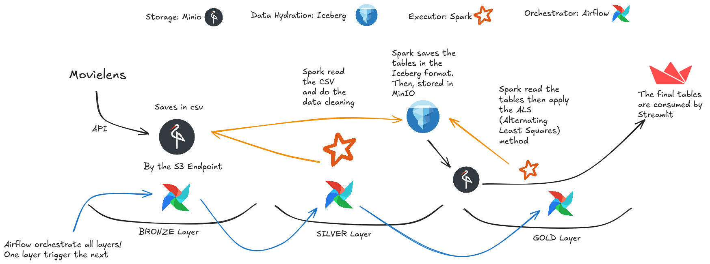
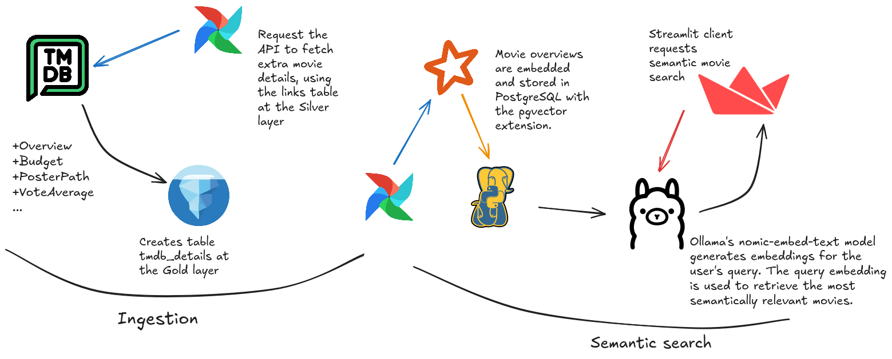
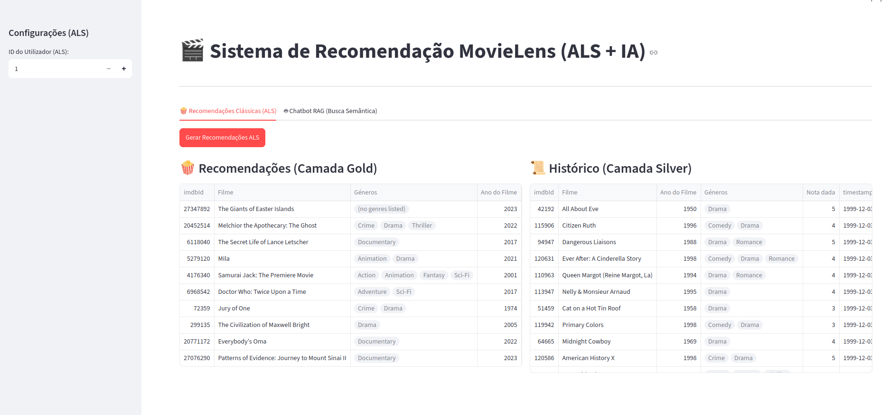
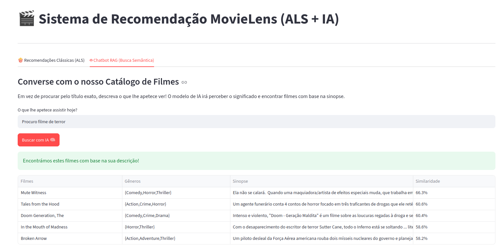

# 🎬 MovieLens Recommendation System

### Data Lakehouse + Apache Spark + Iceberg + Airflow + RAG + Ollama

End-to-end recommendation system combining modern Data Engineering, Machine Learning, and Generative AI.

 

## About

MovieLens Recommendation System is an end-to-end data platform built on a modern Lakehouse architecture.

The project ingests the MovieLens dataset, transforms it with Apache Spark, stores curated data in Apache Iceberg, trains an ALS recommendation model, enriches movies with TMDb metadata, and enables semantic movie search through a Retrieval-Augmented Generation (RAG) pipeline powered by Ollama.

The entire workflow is orchestrated with Apache Airflow and exposed through a Streamlit web application.

## Motivation

Traditional recommender systems rely exclusively on collaborative filtering.

Although they are effective for personalization, they cannot answer natural language questions such as:

> "I'm looking for a psychological thriller with unexpected plot twists."

This project combines:

- a scalable Data Lakehouse
- collaborative filtering
- semantic embeddings
- Retrieval-Augmented Generation (RAG)

to deliver both personalized recommendations and intelligent semantic search.

## Features

- End-to-end Data Lakehouse
- Apache Spark distributed processing
- Apache Iceberg tables
- Airflow orchestration
- ALS Collaborative Filtering
- Time-decay weighting
- Fairness-aware recommendations
- TMDb metadata enrichment
- Semantic Search
- PostgreSQL + pgvector
- Local embeddings with Ollama
- Interactive Streamlit frontend

## Architecture Overview

The project is divided into two main pipelines: the Lakehouse Pipeline (Silver & Gold) and the AI Pipeline (RAG & Vector Database).

### 1. Analytical Pipeline (Lakehouse - ALS)

Fully orchestrated through decoupled Airflow DAGs.

**Silver Layer (ETL & Data Cleaning):**

- PySpark jobs process raw movie, rating, tag, and link datasets.
- Data is cleaned, properly typed, and stored as Apache Iceberg tables in a local S3 bucket powered by MinIO.
- Orchestration: all Spark jobs run inside a dedicated Airflow Pool (`spark_pool`) to optimize resource utilization.

**Gold Layer (Machine Learning - Advanced ALS):**

- Training of a Collaborative Filtering model using Alternating Least Squares (ALS).
- **Freshness (Time Decay):** older ratings receive exponentially decreasing weights, allowing the model to prioritize recent user preferences.
- **Fairness (Diversity):** a logarithmic penalty is applied to blockbuster movies, increasing the visibility of highly rated long-tail titles.
- Final recommendations are stored in Iceberg using a flattened schema optimized for low-latency reads.



### 2. Semantic Search Pipeline (AI / RAG)

To allow users to "chat" with the movie catalog, the project includes a Retrieval-Augmented Generation (RAG) pipeline.

- **Data Enrichment (TMDb API):** a PySpark job reads the links dataset and retrieves movie plots, posters, and budget information from The Movie Database (TMDb), enriching the Iceberg tables in a distributed fashion.
- **Embedding Generation (Ollama):** movie titles, genres, and plot summaries are combined and embedded using the locally hosted `nomic-embed-text` model running on Ollama.
- **Vector Database (PostgreSQL + pgvector):** embeddings are stored in PostgreSQL (shared with Airflow) using the `pgvector` extension, enabling millisecond-scale cosine similarity searches.
- **Frontend (Streamlit):** a lightweight web application divided into two tabs:
  - **Recommendations:** retrieves recommendations from the Silver and Gold Iceberg tables using cached PySpark queries.
  - **AI Search:** embeds the user's query with Ollama and searches PostgreSQL for semantically similar movies instead of relying on keyword matching.




## 🛠️ Technologies

- **Data Processing:** Apache Spark (PySpark)
- **Storage:** Apache Iceberg & MinIO (S3)
- **Orchestration:** Apache Airflow (Docker, SparkSubmitOperator, DockerOperator)
- **Machine Learning (ALS):** Spark MLlib
- **Artificial Intelligence (RAG):** Ollama (Local LLM) & PostgreSQL (pgvector)
- **Frontend:** Streamlit
- **Package Manager:** uv

## 🚀 Quick Start

### Prerequisites

Make sure you have the following installed:

- Docker & Docker Compose
- Python 3.10+
- uv (Python package and dependency manager)
- Ollama (installed with the `nomic-embed-text` model running)
- A TMDb account with a valid API key

### Step 1: Configure the `.env` File

Create a `.env` file containing:

```env
AIRFLOW_UID=1000
TMDB_API_KEY=<YOUR_API_KEY>
```

### Step 2: Start the Infrastructure

Launch the Airflow, Spark Master, MinIO, and PostgreSQL containers from the project root:

```bash
docker compose up -d
```

Wait a few minutes until both the Airflow Webserver and Scheduler are healthy.

### Step 3: Run the Data Pipeline (Airflow)

The complete data pipeline must finish before launching the frontend.

Open the Airflow UI at:

**http://localhost:8080**

Default credentials:

- **Username:** `airflow`
- **Password:** `airflow`

Trigger the `movielens_bronze_ingestion` DAG. It will automatically trigger both:

- `movielens_silver_pipeline`
- `movielens_gold_pipeline`

which build the Silver and Gold layers, respectively.

Alternatively, trigger it from the terminal:

```bash
docker compose run --rm airflow-cli airflow dags trigger movielens_bronze_ingestion
```

### Step 4: Launch the Streamlit Application

Once the Lakehouse and Vector Database have been fully populated, start the frontend.

To ensure the correct `PYTHONPATH` and Spark configuration are loaded, execute Streamlit as a Python module using `uv`:

```bash
uv run python -m streamlit run frontend/app.py
```

Then open:

**http://localhost:8501**

Enter a user ID to view personalized ALS recommendations, or switch to the **AI Search** tab and describe the type of movie you'd like to watch in natural language.

### Pipeline Execution

```text
docker compose up
        │
        ▼
Bronze Ingestion DAG
        │
        ▼
Silver Pipeline
        │
        ▼
Gold Pipeline
        │
        ▼
TMDb Enrichment
        │
        ▼
Embedding Generation
        │
        ▼
uv run python -m streamlit run frontend/app.py
```

## 📂 Project Structure

```text
MovieLens/
├── assets
│   ├── MovieLensLayout.png
│   └── RAGLayout.png
├── dags
│   └── movielens_pipeline.py
├── docker
│   ├── airflow
│   │   └── Dockerfile
│   ├── postgres
│   │   └── initdb
│   │       └── init-multiple-dbs.sh
│   └── spark
│       └── Dockerfile
├── docker-compose.yaml
├── frontend
│   ├── app.py
│   └── __init__.py
├── ingestions
│   ├── __init__.py
│   ├── movielens_raw.py
│   └── tmdb_fetching.py
├── inspect_tables.py
├── pyproject.toml
├── README.md
├── spark_config.py
└── transformations
    ├── als_recommendations.py
    ├── __init__.py
    ├── links.py
    ├── movie_embeddings.py
    ├── movies.py
    ├── ratings.py
    └── tags.py
```
## Demo

### Recommendation Page



### Semantic Search



## Dataset

This project uses the MovieLens dataset.

https://files.grouplens.org/datasets/movielens/ml-32m.zip

TMDb API
https://developer.themoviedb.org/

## Roadmap

- [x] Bronze data ingestion
- [x] Silver data transformations
- [x] Gold recommendation generation
- [x] TMDb metadata enrichment
- [x] Semantic search
- [x] PostgreSQL + pgvector integration
- [x] Streamlit web interface
- [ ] Movie poster integration
- [ ] Docker image publishing
- [ ] CI/CD with GitHub Actions
- [ ] Kubernetes deployment
- [ ] Recommendation API

## License

This project is licensed under the MIT License. See the [LICENSE](LICENSE) file for details.
